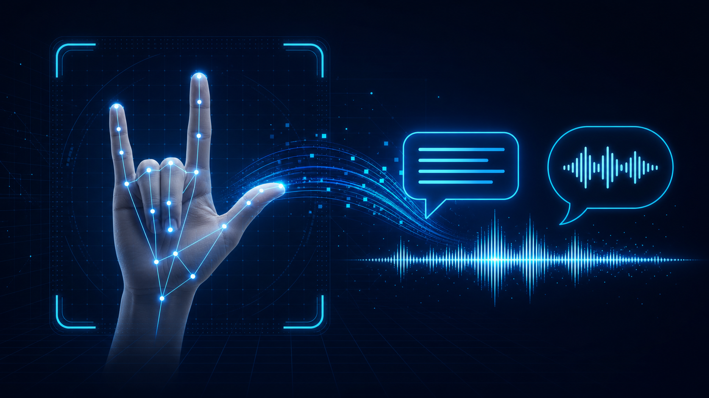
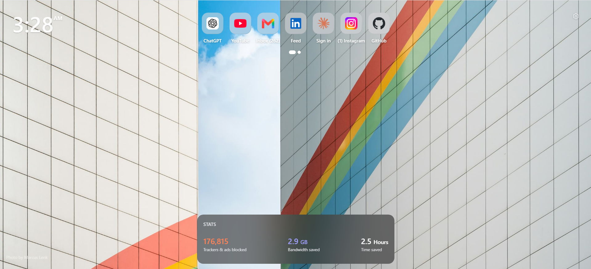
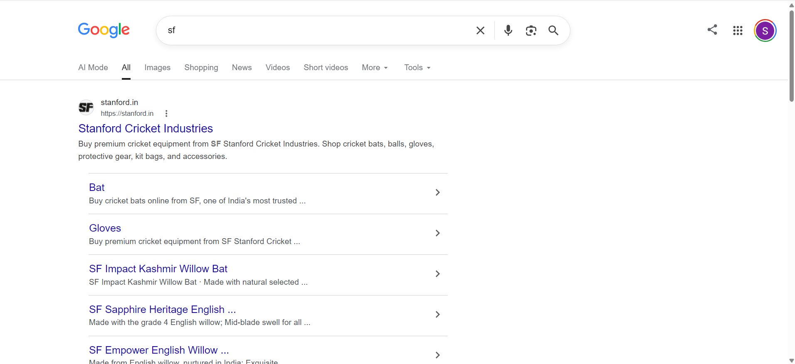
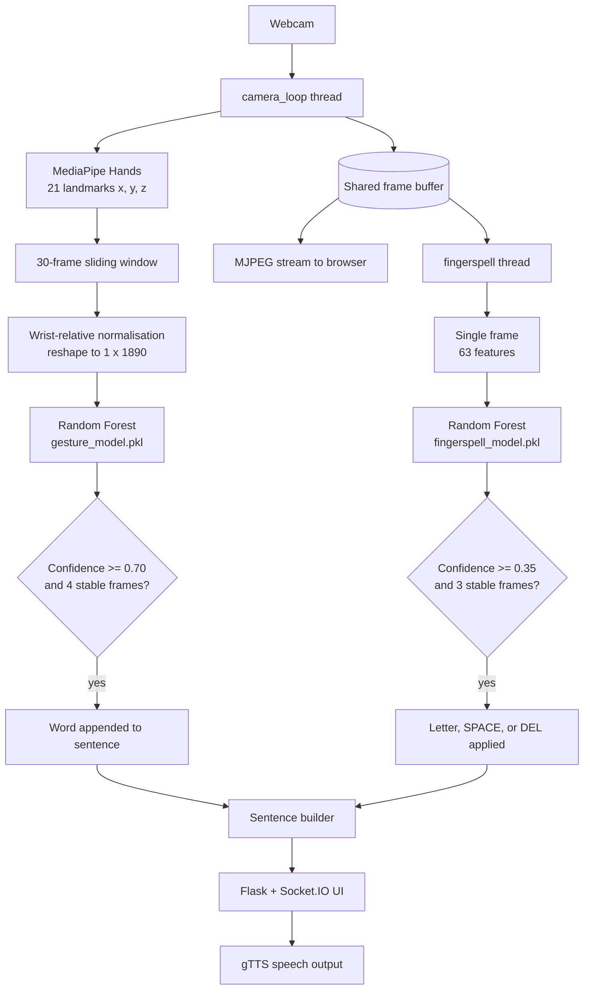

<p align="center">
  
</p>

<h1 align="center">Gesture2Voice</h1>

<p align="center"><strong>Real-time sign gesture and fingerspelling recognition that turns hand input into text and speech.</strong></p>

<p align="center">
  
  
  
  
  
</p>

## Contents

- [About](#about)
- [Features](#features)
- [Demos](#demos)
- [How it works](#how-it-works)
- [Model performance](#model-performance)
- [Installation](#installation)
- [Run the application](#run-the-application)
- [Using Gesture2Voice](#using-gesture2voice)
- [Datasets](#datasets)
- [Retraining the models](#retraining-the-models)
- [Project structure](#project-structure)
- [Deployment](#deployment)
- [Troubleshooting](#troubleshooting)
- [Limitations](#limitations)
- [Contributing](#contributing)
- [Acknowledgements](#acknowledgements)
- [License](#license)

## About

Gesture2Voice is an accessibility-focused Python application that uses an ordinary webcam to recognise hand gestures and fingerspelled letters, assemble them into a sentence, and speak that sentence aloud.

It is aimed at deaf and mute users communicating with people who do not know sign language. MediaPipe extracts hand landmarks from the video stream, scikit-learn Random Forest classifiers turn those landmarks into words and letters, and a Flask + Socket.IO interface streams predictions to the browser in real time.

**Trained models are included in this repository**, so the project runs immediately after cloning — no training step is required to try it.

> **Prototype notice**
> This is an assistive-technology prototype built as a final-year engineering project. It must not be relied on as the only means of requesting emergency help.

## Features

- **Word-gesture mode** — recognises trained word-level signs from a live webcam feed and appends them to a sentence.
- **Fingerspelling mode** — recognises the A–Z alphabet plus the `SPACE`, `DEL`, and `NOTHING` control poses, letter by letter.
- **Sentence building** — words and spelled words accumulate into a sentence with undo, clear, and per-word chips.
- **Speech output** — completed sentences are spoken with Google Text-to-Speech.
- **Four English accents** — US, UK, Indian, and Australian voices, selectable at runtime.
- **Live confidence display** — the current prediction and its confidence score are shown in the browser as you sign.
- **Emergency alert** — a manual on-screen button that repeats a spoken help phrase until dismissed, and pauses gesture recognition while active.
- **Sentence history** — the last few sentences are kept and can be replayed with one click.
- **Data collection and retraining utilities** — scripts and Colab notebooks for adding your own gestures and letters.

## Demos

> The images below are temporary placeholders and will be replaced with short recordings.

### Gesture to word

<p align="center">
  
</p>

Shows a trained gesture being recognised, stabilised, and added to the sentence.

### Fingerspelling to word

<p align="center">
  
</p>

Shows individual letters being recognised, combined into a word, and committed to the sentence. See [the demo recording guide](docs/DEMO_RECORDING.md) before replacing these placeholders.

## How it works

A single camera thread owns the webcam and publishes each frame to shared state. Gesture recognition runs inside that thread; fingerspelling runs in a second thread that reads the same frames. Only one camera handle is ever opened, so both modes can be served at once without contention.



Both models are trained on **wrist-relative** landmarks: every point has the wrist coordinate subtracted from it, which makes recognition largely independent of where the hand sits in the frame.

### Recognition parameters

| Parameter | Gesture mode | Fingerspelling mode |
| --- | --- | --- |
| Input | 30-frame sequence (1,890 features) | Single frame (63 features) |
| Confidence threshold | 0.70 | 0.35 |
| Stability requirement | 4 consecutive identical predictions | 3 consecutive identical predictions |
| Repeat suppression | Same word cannot repeat consecutively | 20-frame cooldown (40 after a space) |
| Inference rate | Every 3rd frame | ~25 Hz |
| Idle reset | Sentence clears after 30 s of inactivity | Manual clear |

These constants live at the top of `app.py` and can be tuned without retraining.

## Model performance

The fingerspelling model shipped in this repository was trained on a custom webcam-collected dataset:

| Metric | Value |
| --- | --- |
| Classes | 29 (A–Z, `SPACE`, `DEL`, `NOTHING`) |
| Images collected | 200 per class |
| Landmark rows extracted | 5,786 (14 images skipped — no hand detected) |
| Classifier | `RandomForestClassifier(n_estimators=300)` |
| Split | 80 / 20 stratified, `random_state=42` |
| **Test accuracy** | **99.05%** on 1,158 held-out samples |
| Macro precision / recall / F1 | 0.99 / 0.99 / 0.99 |

Training is reproducible end to end in [`Fingerspell_Retrain_Custom.ipynb`](Fingerspell_Retrain_Custom.ipynb), which retains its full output including the per-class classification report.

Because the dataset is collected from a single signer, this figure reflects accuracy under conditions similar to collection. Expect lower accuracy for a different signer, different lighting, or a different camera. See [Limitations](#limitations).

## Installation

### Prerequisites

- Python **3.10 or later**
- A working webcam
- Git
- An internet connection — Google Text-to-Speech synthesises audio over the network

### 1. Clone the repository

```bash
git clone https://github.com/DevAshish9090/Gesture2Voice.git
cd Gesture2Voice
```

The trained models (`gesture_model.pkl`, `gesture_labels.pkl`, `fingerspell_model.pkl`, `fingerspell_labels.pkl`) are tracked in the repository, so the clone is around 50 MB.

### 2. Create a virtual environment

```powershell
# Windows PowerShell
python -m venv .venv
.\.venv\Scripts\Activate.ps1
```

```bash
# macOS or Linux
python3 -m venv .venv
source .venv/bin/activate
```

### 3. Install dependencies

```bash
pip install --upgrade pip
pip install -r requirements.txt
```

> **If you plan to collect data or retrain**, also install the full OpenCV build. `requirements.txt` pins `opencv-python-headless`, which has no GUI support, and the collection scripts need `cv2.imshow`:
>
> ```bash
> pip uninstall -y opencv-python-headless && pip install opencv-python
> ```

## Run the application

```bash
python app.py
```

Open <http://127.0.0.1:5000> and allow camera access. The landing page links to both modes.

| Route | Purpose |
| --- | --- |
| `/` | Landing page |
| `/app` | Word-gesture recognition interface |
| `/fingerspell` | Fingerspelling interface |
| `/video_feed`, `/fingerspell_feed` | MJPEG camera streams |

### Desktop-only test

For a lightweight OpenCV window without the web layer:

```bash
python predict.py
```

Press <kbd>S</kbd> to speak the sentence, <kbd>R</kbd> to reset it, and <kbd>Q</kbd> to exit. Note that `predict.py` uses its own, stricter stability settings and is intended for quick model checks rather than everyday use.

## Using Gesture2Voice

### Word-gesture mode

1. Open the main application from the landing page.
2. Keep one hand — the right hand, matching the training data — visible and well lit.
3. Hold a trained gesture until the confidence bar fills and the prediction stabilises.
4. The recognised word is appended to the sentence and appears as a chip.
5. Select **Speak** to hear the full sentence, or **Undo** / **Clear** to correct it.

### Fingerspelling mode

1. Open the fingerspelling page from the landing page or the in-app link.
2. Hold each letter pose steady until it is confirmed; a short cooldown then prevents accidental repeats.
3. Show the `SPACE` pose to commit the current word and start the next one.
4. Show `DEL` to remove the last letter.
5. Use the on-screen controls to clear, undo a word, or speak the sentence.

### Emergency alert

The **Emergency Alert** button on the gesture page is triggered manually. Once pressed, the application repeats a spoken help phrase until it is dismissed, and gesture recognition is paused for the duration so the alert cannot be interrupted by a stray prediction.

### Recognition tips

- Use bright, even lighting and a plain background.
- Keep the whole hand inside the frame.
- Match the distance and orientation you used when collecting data.
- Hold a pose steady before moving to the next one.
- Retrain after adding new labels or a meaningful number of new samples.

## Datasets

Both datasets are included in the repository so results can be reproduced.

### Word-gesture dataset

Each sample is a `.npy` file holding a 30-frame sequence of 21 landmarks × 3 coordinates (shape `30 × 63`).

```text
dataset/
├── HELLO/
│   ├── sample_0.npy
│   └── sample_1.npy
├── THANK_YOU/
│   └── sample_0.npy
└── EMERGENCY/
    └── sample_0.npy
```

To collect a new class:

1. Open `collect_data.py` and set `GESTURE_NAME`, for example `HELLO`.
2. Run `python collect_data.py`.
3. Press <kbd>Space</kbd> to record one 30-frame sample; press <kbd>Q</kbd> to finish.
4. The script prompts you to vary distance and angle every 50 samples. Follow it — around 200 varied samples per class works well.

### Fingerspelling dataset

Each sample is a single clean webcam frame — landmarks are drawn on the preview only, never on the saved image.

```text
fingerspell_dataset/
├── A/sample_0.jpg
├── B/sample_0.jpg
├── SPACE/sample_0.jpg
├── DEL/sample_0.jpg
└── NOTHING/sample_0.jpg
```

To collect a label:

1. In `collect_fingerspell_data.py`, set `GESTURE_NAME` to the label.
2. Run `python collect_fingerspell_data.py`.
3. Show the pose and press <kbd>Space</kbd> to save each image, varying distance, lighting, and angle.

Folder names must be uppercase and must match the control labels exactly (`SPACE`, `DEL`, `NOTHING`), because `app.py` compares predictions against those strings.

## Retraining the models

### Fingerspelling

Use [`Fingerspell_Retrain_Custom.ipynb`](Fingerspell_Retrain_Custom.ipynb) in Google Colab. Landmark extraction across several thousand images is slow on a laptop and takes a few minutes on Colab.

1. Zip your `fingerspell_dataset/` folder and upload it to `MyDrive/Gesture2Voice/fingerspell_dataset.zip`.
2. Open the notebook in Colab and run the cells in order.
3. Cell 4 reports the class distribution and flags any class with fewer than 50 samples.
4. Cell 5 trains the Random Forest and prints the accuracy and classification report.
5. Cell 7 downloads `fingerspell_model.pkl` and `fingerspell_labels.pkl`. Replace the files in the project root.

To validate a dataset locally without Colab and without saving a model:

```bash
python test_fingerspell.py
```

This extracts landmarks, trains a quick Random Forest, prints the accuracy report, and opens a live webcam test window. Press <kbd>Q</kbd> to exit.

### Word gestures

The word-gesture model is a Random Forest over flattened, wrist-normalised sequences: each sample is reshaped from `30 × 63` to a single 1,890-feature row. Collect samples with `collect_data.py`, then train with the same configuration used for fingerspelling (`n_estimators=300`, 80/20 stratified split), and save `gesture_model.pkl` alongside a `gesture_labels.pkl` mapping class indices to words.

Keep the normalisation identical to `normalize_landmarks()` in `app.py` — subtract the wrist landmark from every point, per frame — or predictions will not match training.

## Project structure

```text
Gesture2Voice/
├── app.py                            # Flask app, camera thread, both recognition loops
├── sentence_speech.py                # Sentence construction and gTTS playback
├── predict.py                        # Desktop-only word-gesture test
├── collect_data.py                   # Word-gesture data collection
├── collect_fingerspell_data.py       # Fingerspelling data collection
├── test_fingerspell.py               # Local fingerspell training and live test
├── extract_landmarks.py              # Webcam landmark inspection utility
├── hand_detection.py                 # Minimal MediaPipe hand-detection demo
├── Fingerspell_Retrain_Custom.ipynb  # Colab notebook — trains the shipped model
├── gesture_model.pkl                 # Trained word-gesture classifier
├── gesture_labels.pkl                # Word-gesture class labels
├── fingerspell_model.pkl             # Trained fingerspelling classifier
├── fingerspell_labels.pkl            # Fingerspelling class labels
├── dataset/                          # Word-gesture samples (.npy sequences)
├── fingerspell_dataset/              # Fingerspelling samples (.jpg images)
├── static/                           # CSS, JavaScript, icons
├── templates/                        # landing.html, index.html, fingerspell.html
├── docs/                             # README assets and documentation
└── requirements.txt
```

## Deployment

The application runs on Flask's Socket.IO server in threading mode and needs direct access to a physical camera, which rules out most standard container platforms. It has been served publicly from a local machine via [Cloudflare Tunnel](https://developers.cloudflare.com/cloudflare-one/connections/connect-networks/) at `gesture2voice.in`, which requires no inbound port forwarding.

If you deploy it yourself, note that `app.config['SECRET_KEY']` is hard-coded in `app.py` and should be moved to an environment variable first.

## Troubleshooting

| Problem | Try this |
| --- | --- |
| `FileNotFoundError` for a `.pkl` file | Make sure all four `.pkl` files are in the project root. If you cloned without Git LFS or moved files around, re-pull the repository. |
| `cv2.error: ... not implemented` on a collection script | Replace `opencv-python-headless` with the full `opencv-python` build (see [Installation](#installation)). |
| `InconsistentVersionWarning` or unpickling errors | The models were pickled with scikit-learn 1.8.0. Install the pinned versions from `requirements.txt` rather than newer ones. |
| Camera does not open | Close other apps using the camera, restart the application, and grant the browser permission. Only one process can hold the webcam. |
| Video feed is blank | Wait a few seconds after startup — the stream begins once the camera thread captures its first frame. |
| Predictions are inaccurate | Improve lighting, match your training distance and angle, collect more varied samples, and retrain. |
| Speech does not play | gTTS needs network access, and audio is played on the machine running `app.py`, not the browser host. |
| `ModuleNotFoundError` | Activate the virtual environment, then rerun `pip install -r requirements.txt`. |

## Limitations

- Trained on right-hand samples from a single signer, so accuracy drops for other users, left-handed signing, and unfamiliar lighting or backgrounds.
- Only one hand is tracked (`max_num_hands=1`), so two-handed signs are out of scope.
- Audio plays on the server machine, which means remote access over a tunnel gives you the interface but not the sound.
- The gesture vocabulary is limited to the trained classes; anything outside it is either misclassified or rejected by the confidence threshold.
- Recognition is pose- and sequence-based, not grammatical — it produces word sequences, not fully formed sign language grammar.

## Contributing

Contributions, bug reports, and feature ideas are welcome. Please read [CONTRIBUTING.md](CONTRIBUTING.md) and follow the [Code of Conduct](CODE_OF_CONDUCT.md).

## Acknowledgements

- [MediaPipe Hands](https://developers.google.com/mediapipe) for hand landmark detection.
- [scikit-learn](https://scikit-learn.org/) for the Random Forest classifiers.
- [gTTS](https://gtts.readthedocs.io/) for speech synthesis.

All gesture and fingerspelling data in this project was collected first-hand via webcam. No public sign language dataset was used to train the shipped models.

Built as a final-year B.Tech project at Bhagwan Parshuram Institute of Technology, New Delhi.

## License

Distributed under the [MIT License](LICENSE).
