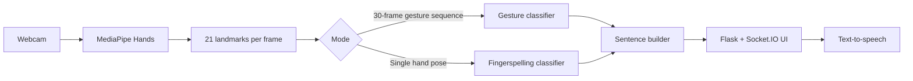

<p align="center">
  
</p>

<h1 align="center">Gesture2Voice</h1>

<p align="center"><strong>A real-time hand gesture and fingerspelling recognition system that turns sign input into text and speech.</strong></p>

<p align="center">
  
  
  
  
</p>

## Contents

- [About](#about)
- [Features](#features)
- [How it works](#how-it-works)
- [Installation](#installation)
- [Datasets](#datasets)
- [Train the models](#train-the-models)
- [Run the application](#run-the-application)
- [Use Gesture2Voice](#use-gesture2voice)
- [Demos](#demos)
- [Project structure](#project-structure)
- [Troubleshooting](#troubleshooting)
- [Contributing](#contributing)

## About

Gesture2Voice is an accessibility-focused Python application that uses a webcam to recognise hand gestures and fingerspelled letters. It converts recognised input into a sentence and can speak that sentence aloud. The web interface is built with Flask and Socket.IO; MediaPipe extracts hand landmarks and scikit-learn models perform classification.

> **Prototype notice:** This project is an assistive-technology prototype. It must not be relied on as the only means of requesting emergency help.

## Features

- Detects trained word-level hand gestures from a live webcam feed.
- Recognises fingerspelled letters and the `SPACE`, `DEL`, and `NOTHING` controls.
- Builds sentences from predicted words or letters.
- Displays live prediction confidence in the browser.
- Speaks completed sentences using Google Text-to-Speech.
- Includes data collection and training utilities for custom gestures and letters.

## How it works



## Installation

### Prerequisites

- Python **3.10 or later**
- A working webcam
- Git
- An internet connection for Google Text-to-Speech playback

### 1. Clone the repository

```bash
git clone https://github.com/YOUR-USERNAME/gesture2voice.git
cd gesture2voice
```

### 2. Create a virtual environment

```powershell
# Windows PowerShell
python -m venv .venv
.\.venv\Scripts\Activate.ps1
```

On macOS or Linux:

```bash
python3 -m venv .venv
source .venv/bin/activate
```

### 3. Install dependencies

```bash
pip install --upgrade pip
pip install -r requirements.txt
```

## Datasets

The repository intentionally ignores datasets and trained `.pkl` models. They can be large, are generated locally, and should not be committed to Git.

### Word-gesture dataset

The word-gesture model uses sequences of 30 frames. Each saved `.npy` file holds 21 hand landmarks × 3 coordinates for every frame (shape: `30 × 63`).

Expected layout:

```text
dataset/
├── HELLO/
│   ├── sample_0.npy
│   └── sample_1.npy
├── THANK_YOU/
│   └── sample_0.npy
└── EMERGENCY/
    └── sample_0.npy
```

If you use the supplied `Dataset.zip`, extract it so that the final path is `dataset/<GESTURE_NAME>/sample_0.npy`. Do **not** leave an extra `Dataset/dataset/` folder level around the files.

To collect a new class with your webcam:

1. Open `collect_data.py` and set `GESTURE_NAME`, for example `HELLO`.
2. Run `python collect_data.py`.
3. Press <kbd>Space</kbd> to record a sample; press <kbd>Q</kbd> to finish.
4. Repeat for every gesture class. Aim for at least 100–200 varied samples per class.

### Fingerspelling dataset

The fingerspelling model uses individual image samples. Collect data for `A`–`Z` and for the control labels `SPACE`, `DEL`, and `NOTHING`.

```text
fingerspell_dataset/
├── A/sample_0.jpg
├── B/sample_0.jpg
├── SPACE/sample_0.jpg
├── DEL/sample_0.jpg
└── NOTHING/sample_0.jpg
```

To collect a label:

1. In `collect_fingerspell_data.py`, set `GESTURE_NAME` to the label you are collecting.
2. Run `python collect_fingerspell_data.py`.
3. Show the hand pose and press <kbd>Space</kbd> to save each image.
4. Repeat for every label, varying distance, lighting, and angle.

`extract_asl_landmarks.py` is an optional utility for extracting landmarks from the [ASL Alphabet dataset](https://www.kaggle.com/datasets/grassknoted/asl-alphabet). It expects an `asl_alphabet_train/` folder beside the script.

## Train the models

Run these commands from the project root after preparing the datasets.

### Train the word-gesture model

```bash
python train_gesture_model.py
```

This creates:

```text
gesture_model.pkl
gesture_labels.pkl
```

### Train the fingerspelling model

```bash
python train_fingerspell_model.py
```

This creates:

```text
fingerspell_model.pkl
fingerspell_labels.pkl
```

All four files must be in the project root before running the complete web application. Keep them locally, attach them to a GitHub Release, or provide a documented download link. Do not commit them directly.

## Run the application

Start the Flask application:

```bash
python app.py
```

Then open [http://127.0.0.1:5000](http://127.0.0.1:5000) and allow the browser to use your webcam.

For a lightweight desktop-only test of the word-gesture model, run:

```bash
python predict.py
```

Press <kbd>S</kbd> to speak the sentence, <kbd>R</kbd> to reset it, and <kbd>Q</kbd> to exit.

## Use Gesture2Voice

### Gesture-to-word mode

1. Open the main application from the landing page.
2. Keep one hand visible in the camera frame with good, even lighting.
3. Hold a trained gesture briefly until the prediction is stable.
4. The recognised word is added to the sentence.
5. Choose **Speak** to hear the sentence aloud.

### Fingerspelling mode

1. Open the fingerspelling page from the landing page.
2. Hold each letter pose steadily until it is confirmed.
3. Show the `SPACE` pose to commit the current word.
4. Show `DEL` to remove the most recently entered letter.
5. Use the on-screen controls to clear, undo, or speak the completed sentence.

### Recognition tips

- Use bright, even lighting and a plain background.
- Keep your hand fully inside the webcam frame.
- Match the distance and orientation used while collecting data.
- Hold a gesture steady before changing pose.
- Retrain after adding new labels or a meaningful number of samples.

## Demos

> The images below are temporary placeholders. They will be replaced with short Gesture2Voice GIFs.

### Gesture to word

<p align="center">
  
</p>

This GIF will show a trained gesture being recognised and added to the sentence.

### Fingerspelling to word

<p align="center">
  
</p>

This GIF will show individual letters being recognised, combined into a word, and added to the sentence. See [the demo recording guide](docs/DEMO_RECORDING.md) when you are ready to replace these placeholders.

## Project structure

```text
Gesture2Voice/
├── app.py                        # Flask web application and live recognition loops
├── predict.py                    # Desktop word-gesture test
├── collect_data.py               # Word-gesture data collection
├── collect_fingerspell_data.py   # Fingerspelling data collection
├── train_gesture_model.py        # Trains and saves the word-gesture model
├── train_fingerspell_model.py    # Trains and saves the fingerspelling model
├── extract_landmarks.py          # Webcam landmark inspection utility
├── extract_asl_landmarks.py      # ASL Alphabet landmark extraction utility
├── sentence_speech.py            # Sentence construction and speech playback
├── static/                       # CSS, JavaScript, and icons
├── templates/                    # Flask templates
└── docs/                         # README assets and documentation
```

## Troubleshooting

| Problem | Try this |
| --- | --- |
| `FileNotFoundError` for a `.pkl` file | Train the models or place the four generated `.pkl` files in the project root. |
| Camera does not open | Close other apps using the camera, then restart the application and grant browser permission. |
| Predictions are inaccurate | Collect more varied samples, improve lighting, and retrain the relevant model. |
| `ModuleNotFoundError` | Activate the virtual environment, then rerun `pip install -r requirements.txt`. |
| Speech does not play | Check your internet connection and system audio output; Google Text-to-Speech requires network access. |

## Contributing

Contributions, bug reports, and feature ideas are welcome. Please read [CONTRIBUTING.md](CONTRIBUTING.md) and follow the [Code of Conduct](CODE_OF_CONDUCT.md).

## License

Distributed under the [MIT License](LICENSE).
